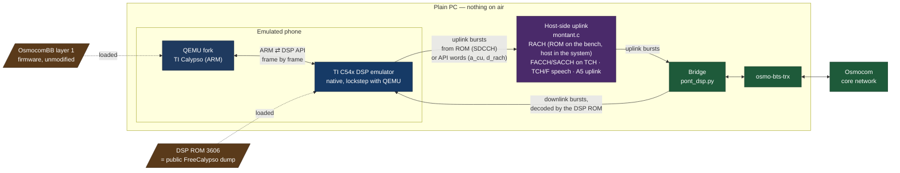

# Emulating the baseband

A complete GSM call on an ordinary PC, where the phone's real layer 1 firmware and the real baseband DSP
code take part, down to the lowest layers of 2G. I forked QEMU to emulate the TI Calypso platform so
that OsmocomBB's layer 1 runs on it, and I wrote an emulator for the TI C54x DSP that layer 1 talks to.
Nothing goes on air: no SDR, no radio hardware, no spectrum licence. The baseband is the most closed
part of a phone. Ever wanted to watch what a 2G DSP actually does, step by step, without any hardware?
Now you can.

On the phone side, the QEMU Calypso machine loads the unmodified OsmocomBB layer 1 firmware as the real
ARM would, and a native C54x emulator runs the DSP from its
mask ROM — identical, word for word, to the public FreeCalypso dump of ROM version 3606, which is where
to get it; nothing is redistributed here.

Layer 1 drives the DSP through its shared API, as on real hardware. In the downlink, the DSP ROM itself
does the work: frequency burst detection, synchronisation, control channel and speech decoding, A5
deciphering. In the uplink, SDCCH is produced by the ROM too, after four bugs in the emulated core were
fixed; RACH, FACCH/SACCH on traffic channels, uplink speech and uplink A5 are still encoded on the host
side in the full system, and moving them into the DSP is the current work (the RACH already is, on the
bench: see below). A bridge connects the phone to osmo-bts-trx, following the design of fixeria's
trxcon, and an Osmocom core network handles the call on the other side. An end-to-end test bench checks
the whole chain, from boot to attach, SMS, USSD, a voice call and a test tone recovered through it. An
experimental mode runs layer 1 without the TI ROM, with host-side signal processing (gr-gsm,
libosmocoding): not a free baseband yet, but the layer above it running without the vendor's code.

One number to keep in mind while reading the rest: of the 230 worked examples of TI's instruction set
manual (SPRU172C) that the bench extracts, the emulated C54x core passes 150, fails 58, and 22 cannot be
assembled by the harness. Every « the ROM does X » below is conditional on the core executing the instructions of that
path correctly; the two bugs found on 2026-10-04 were found exactly that way.

## Three stages, as they appear in the code

1. **Layer 1 in QEMU.** The QEMU fork runs an unmodified `layer1.highram` on the Calypso machine (a
   patched build that passed bad speech frames at zero gain was used from 2026-10-03 to 2026-10-04 and
   has been removed). The API RAM is the real one (`/dev/shm/calypso_api_ram`), and the ARM ⇄ DSP dialogue happens frame by frame.
2. **The gr-gsm shunt.** The `grgsm` mode of `run.sh`, the `shunt_*` traces and `l1-grgsm/`: a « host
   path » in which gr-gsm did FB/SB detection inside QEMU, the libosmocoding bridge did channel decoding
   and the bridge did A5. The DSP was bypassed; the host rebuilt the signal processing.
3. **The DSP that works.** `c54x_exe`: the TI mask ROM executed on the emulated C54x core, in lockstep
   with QEMU. State on 2026-10-03, from the bench's coverage table (one line per signal-processing
   step): 6 steps done by the ROM (FB, SCH, control channels, FACCH, speech decoding, A5 downlink),
   7 by the host (IMMEDIATE ASSIGNMENT reference retouched — the table counts it as a host step, the
   ROM pattern being absent by construction —, RACH, A5 uplink, FACCH uplink, SACCH on TCH uplink,
   uplink speech, vocoder), 1 mixed (SDCCH uplink: 134 blocks by the ROM, 1 by the host).

## What "processor fidelity" means now

Fidelity is no longer measured as « does the phone register » but as « how many API RAM words and how
many bits at the antenna are produced by the ROM itself ». The capture point sets the fidelity:

- **Capturing at `0x3f8a`** (what `tx_rom_publier` does today) takes the coded bits *before* the
  modulator. The host still has to add the training sequence, synchronisation and tail bits, and redo A5
  at the right frame number.
- **Capturing the TSP script** (`0x3cbb..`, marker `0x1c0a` = TOGBR2, then 16 BULDATA words of 10 bits)
  takes the stream *the ABB would receive on silicon*, with training sequence, tails, I/Q inversion and
  A5 already applied. The host then only converts ABB words into 148 bits and places them at the right
  fn/tn. In the ROM this capture point serves every burst type (NB, RACH, TCH): one pipe, the ROM decides
  everything.

That second capture point did not exist in emulation until 2026-10-04, and not because of the host: the
ROM wrote the burst, the core did not know how to execute two of the instructions on the way. The
emitter loop at PROM0 `0x8608` begins with `cmpr eq,ar2 ; rc tc` and the core had no `CMPR` at all (a
no-op, so the loop returned at once on a stale flag); once that was fixed, the 16 words came out as
`0xff06` sixteen times, because `LD src, ASM` ignored its shift and the bit accumulator never moved. With
both fixed, the bench's new `rach` test shows the ROM executing the RACH task (`0xb6fd`, then `0x85a2`),
writing its 36 coded bits to `0x3f8a`, and the emitter producing the exact 05.02 access burst in the
script — extended tail `00111010`, the 41-bit synchronisation sequence copied from the data ROM at
`0xa0d9`, the 36 bits, three tail bits, guard — bit for bit what libosmocoding's
`gsm0503_rach_ext_encode` gives, 5 attempts out of 5. On the bench only: in the full system
`montant.c` still erases `d_task_ra` before the ROM can see it, and the bridge still codes the RACH.
Connecting the pipe is the next step, and it is now a plumbing step.

## The hierarchy for what comes next

- **Before any new pipe: the 58 failing SPRU172C examples.** They are the manufacturer's own test
  vectors; each is a candidate for the next « the ROM computes wrongly ». Two were found by symptom this
  week (CMPR, LD src,ASM); the list finds them by construction.
- **Then the single pipe:** make the TSP script the source of all uplink bursts (RACH, SDCCH, TCH,
  SACCH, FACCH), and transmit at the ROM's frame number so that its A5 is the right one — after reading
  in the ROM which frame counter it uses for the uplink stream, which has not been done.
- **Cases where the ROM computes wrongly or not at all in the system:** downlink SACCH/8 often failing
  its FIRE check (the 2026-10-03 note says « ~80 % », without a count), `B_BFI` on speech, and on the
  bench `nb` and `fb0`/`fb1`. Instruction-level debugging,
  like the four bugs behind the SDCCH uplink.
- **The most distant fidelity:** the vocoder in the ROM, which means modelling the audio path from the
  DSP to the ABB.

In other words, the DSP has stopped being an obstacle to work around and has become the reference:
whenever the host still does something, it is either because it has not yet been given the ROM's pipe,
or because the core still has a bug. Both are measurable, and that is what is being measured — the
evidence for every sentence above is in `docs/CLAIMS-2026-10-04.md`.
